<head>
  
</head>

# Co telefony wiedzą o tobie, projekt z klasteryzacji - raport
Autorzy: [Mateusz Deptuch](https://github.com/DeptuchMateusz), [Paweł Florek](https://github.com/FlorekPawel)
## 0. Spis treści
1. [Dane](#1-dane)
2. [EDA](#2-eda)
3. [Preprocessing danych i feature selection](#3-preprocessing-danych-i-feature-selection)
4. [Modelowanie](#4-modelowanie)
5. [Wyniki](#5-wyniki)
6. [Wnioski](#6-wnioski)

## 1. Dane
Dane użyte w projekcie pochodziły ze strony kaggle, https://www.kaggle.com/datasets/uciml/human-activity-recognition-with-smartphones.
Celem projektu była klasteryzacja danych zebranych z czujników znajdujących się w telefonach osób testowych (później *subject*), których było 30. Wykonywali oni codzienne aktywności mając przy sobie swoje telefony z aktywnymi czujnikami (akcelerometr, żyroskop). 
Założeniem projektu na kaggle była klasyfikacja aktywności do jednej z cześciu kategorii, jednakże nie posiadaliśmy takowej informacji z powodu innego celu naszej pracy.

Sygnały jakie przechwytywały czujniki były następujące:
- tBodyAcc
- tGravityAccMag
- tBodyGyroJerkMag
- tBodyAccJerk
- tBodyGyro
- tBodyAccJerkMag
- tBodyGyroJerk
- tBodyAccMag
- tGravityAcc
- tBodyGyroMag
- fBodyAcc
- fBodyBodyGyroMag
- fBodyAccJerk
- fBodyBodyAccJerkMag
- fBodyAccMag
- fBodyGyro
- fBodyBodyGyroJerkMag,

w trzech osiach X, Y, Z. Przedrostek 't' oznacza, że dany sygnał został zapisany w domenie czasowej, natomiast przedrostek 'f' oznacza zapis w domenie frekwencyjną po zastosowaniu Szybkiej Transformacji Fouriera.
Zostały one zapisane przy użyciu funkcji:
- max()
- mad()
- min()
- kurtosis()
- bandsEnergy()
- mean()
- meanFreq()
- arCoeff()
- entropy()
- iqr()
- sma()
- std()
- maxInds()
- skewness()
- energy()
- correlation().

## 2. EDA
Przed rozpoczęciem pracy z przygotowywaniem danych oraz modelowaniem dokonaliśmy Eksploracyjnej Analizy Danych.
Ramka danych po podziale zbioru na zbiór modelarzy oraz zbiór walidatorów posiadała 10299 wierszy oraz 561 kolumn. Nie zawierała żadnych braków wartości oraz żadnych duplikujących się wierszy. 

Dokonaliśmy analizy danych dla dwóch funkcji: mean oraz entropy.

#### Analiza mean
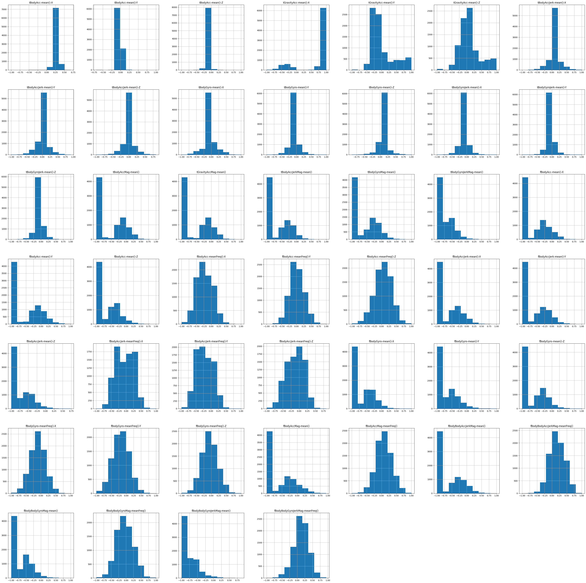
Dla mean obserwujemy dużo rozkładów.

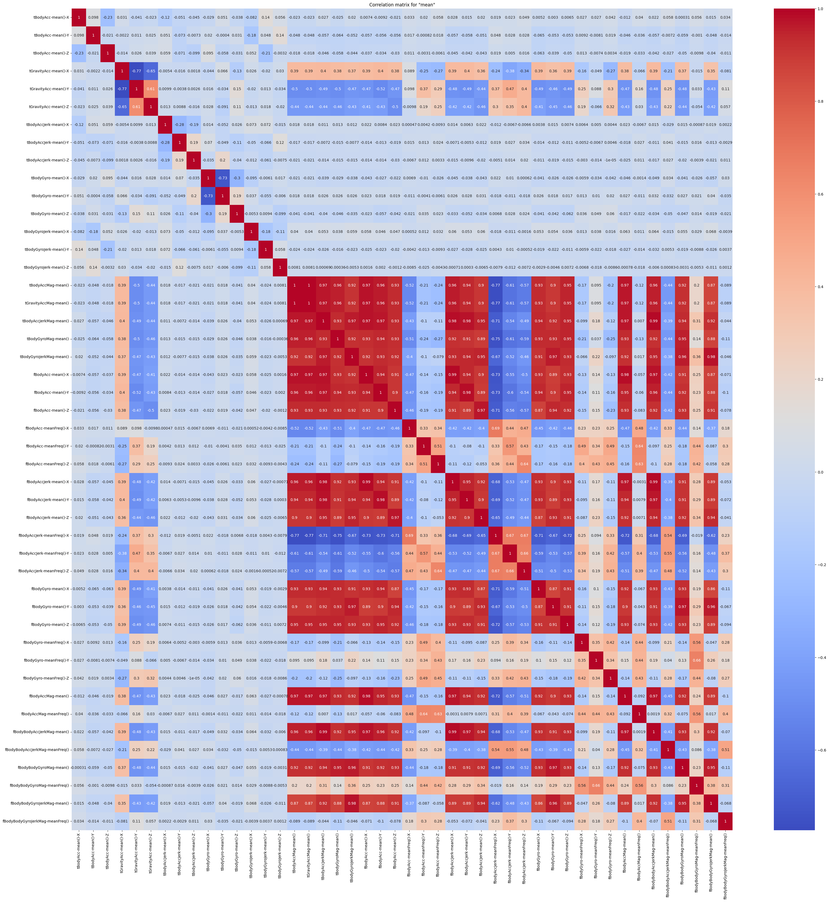
Zauważamy duże korelacje niektórych kolumn. Będziemy mogli rozważyć usunięcię niektórych z nich w celu redukcji wymiarów naszych danych.

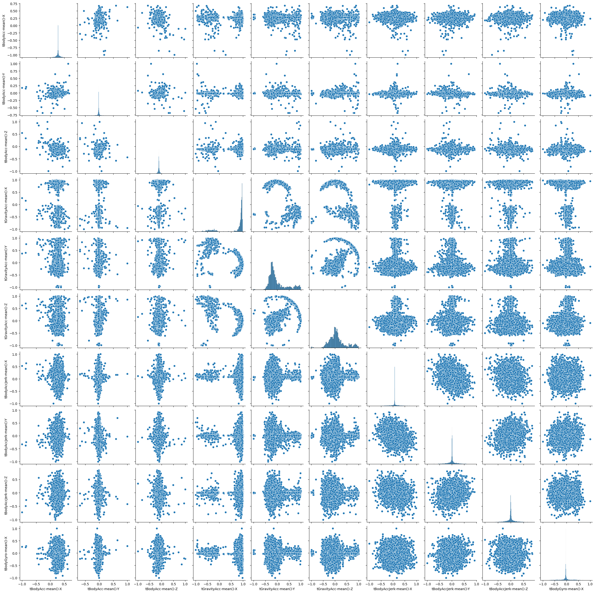
Pomimo bardzo dużo skorelowanych kolumn, na powyższych pairplotach jesteśmy w stanie zaobserowować dużą ilość podziałów na klastry. 

Nasze dane były poddane już obróbce, bowiem wszystkie wartości znajdują się w przedziale $[-1, 1]$, co potwierdza również poniższa tabela. 

Ponadto nie musimy się przejmować wartościami odstającymi, ponieważ takowych nie posiadamy.

#### Analiza entropy

Ponownie obserwujemy bardzo dużo skorelowanych kolumn. 

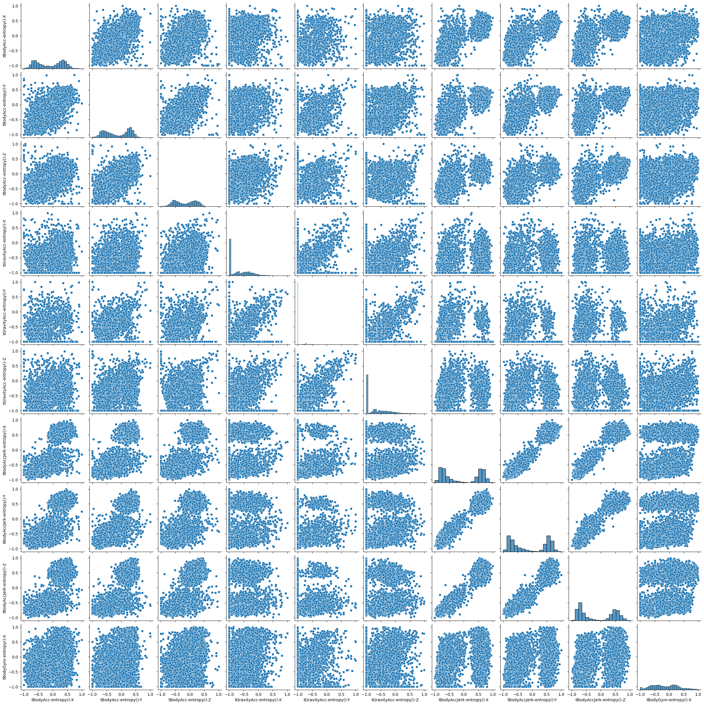
Możemy dostrzec powstaniu paru ugrupowań.

#### Wizualizacja danych - tSNE
Na koniec EDY spójrzmy jak nasze dane wyglądają po zastosowaniu funkcji do redukcji wymiarów TSNE.

Łatwo dostrzec utworzenie się trzech klastrów, jednak nie możemy bazować na tej metodziej w celu ustalenia optymalnej liczby klastrów.

## 3. Preprocessing danych i feature selection
Nasze dane były już znormalizowane oraz nie zawierały żadnych braków. Nie było wartości odstających oraz danych kategorycznych. Zatem cały etap przetwarzania danych mogliśmy pominąć

#### Wybór cech
Od razu na początku pracy nad projektem usunęliśmy kolumne z informacją o rodzaju aktywności, ponieważ nie była nam potrzebna i mogła tylko przeszkodzić w pracy nad klasteryzacją. Podobny los spotkał kolumne o ID osoby testowej, gdyż nie niosło to żadnej użytecznej informacji.

Przejdźmy teraz do pozostałych kolumn. Jak ustaliliśmy w części EDA, nasze dane zawierają dużo skorelowanych kolumn. Po sprawdzeniu tego okazało się, że ustawiając nasz górny limit korelacji na poziomie 0.98, mogliśmy pozbyć się 214 kolumn właśnie z powodu wysokiego skorelowania z inną kolumną. Tak też zostało uczynione, co doprowadziło do redukcji wymiaru danych do 347 kolumn.

Następnie zastosowaliśmy metodę PCA do redukcji wymiarów.

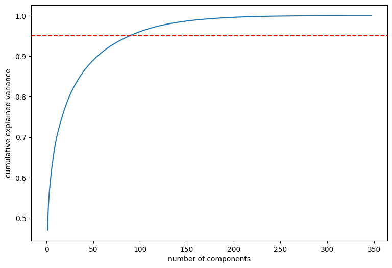
Zastosowaliśmy parametr *n_components = 0.95*, zachowując 95% wariancji. Dało to nam ostateczny wymiar 89 kolumn.

## 4. Modelowanie
#### KMeans
Pierwszym analizowanym modelem jest metoda KMeans. W celu określenia optymalnej liczby klastrów skorzystaliśmy z paru metod. 

Na wykresie wyżej przedstawione są odległości wewnątrz danej liczby klastrów. Wykorzystując metodę łokcia ustaliliśmy, że najlepszą liczbą będzie dwa.

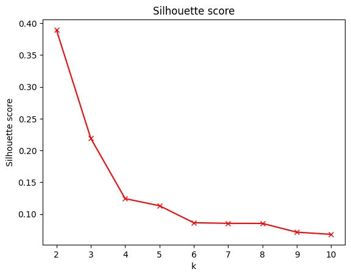
Chcąc uzyskać jak największy Silhouette Score, ponownie ustaliliśmy liczbę klastrów na dwa. 

Ponownie chcemy zmaksymalizować Caliniski-Harabasz Score, co jest osiągane przy wartości *n\_clusters = 2*. 

Tym razem minimalizujemy wyniki. Minimalna wartość  *Davies-Bouldin Score* występuje dla dwóch klastrów.

Po uwzględnieniu powyższych wyników przeprowadziliśmy wizualizację danych przy użyciu t-SNE dla metody KMeans, ustawiając parametr *n\_clusters = 2*.

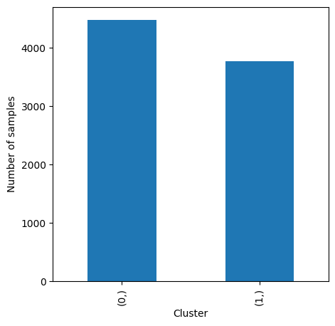
Dostaliśmy widoczny podział na dwa w miarę równe klastry. Jednakże na wizualizacji widać, że niektóre punkty z klastra oznaczone kolorem żółtym znajdują się pomiędzy punktami z klastra fioletowego. Mając to na uwadze sprawdziliśmy jeszcze dwie inne metody: *KMedoids* i *GMM*

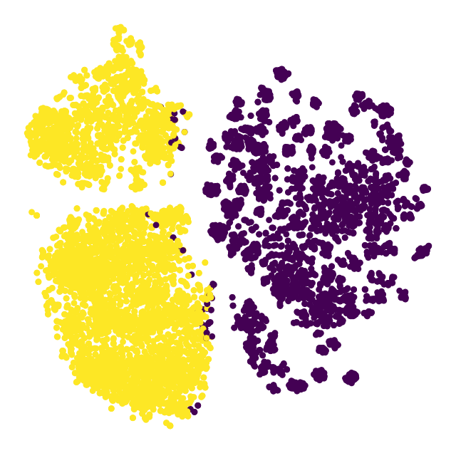
*KMedoids*

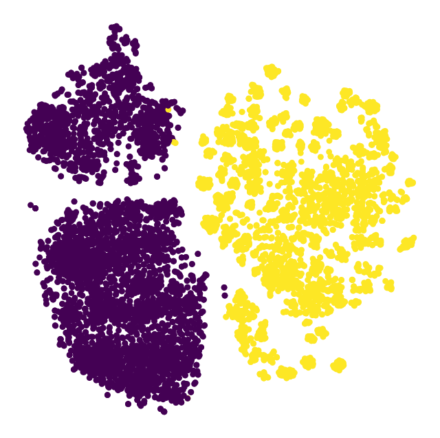
*GMM*

#### DBSCAN
W celu ustalenia optymalnego epsilona próbowaliśmy znaleźć moment, dla którego odległości zaczną gwałtowanie rosnąć. Ustaliliśmy wartość 3.4

Następnie dla danego epsilona szukaliśmy dobrej wartości dla *min_samples*.

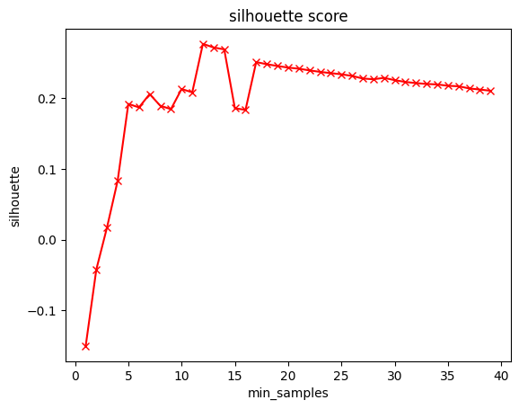

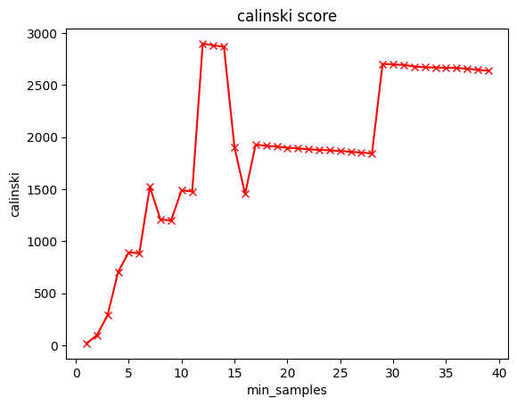

Analizując powyższe wykresy, ustawiliśmy wartość na 12.
Po zastosowaniu powyższych parametrów otrzymaliśmy poniższe wyniki:

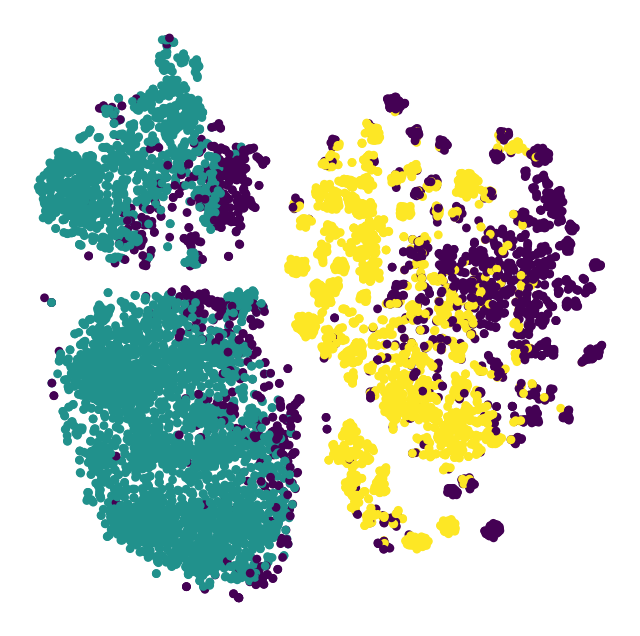

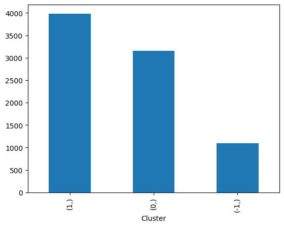

DBSCAN odrzuca aż 1000 wyników, co nie jest dla nas zadowalające. Są one zaznaczone kolorem fioletowym. Jest to na pewno duży problem, gdybyśmy zdecydowali się użyć modelu DBSCAN.

#### Aglomerative Clustering
Przejdźmy do medoty grupowania aglomeracyjnego. Poniżej znajduję się wizualizacja, jak nasz model radzi sobie bez żadnych ustawiania hiperparametrów.

Ponownie sprawdziliśmy metryki w celu znalezienia optymalnej liczby klastrów.
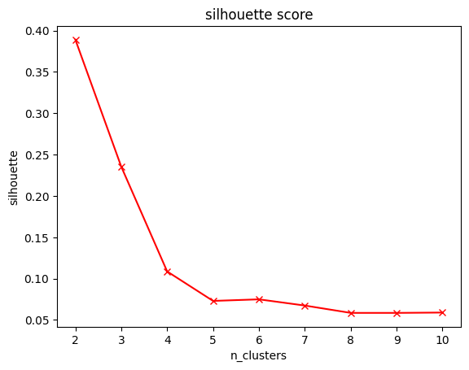

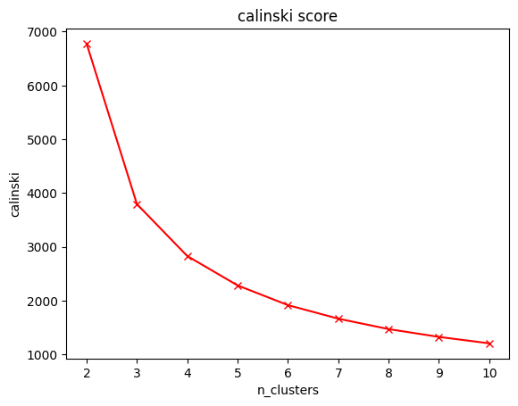

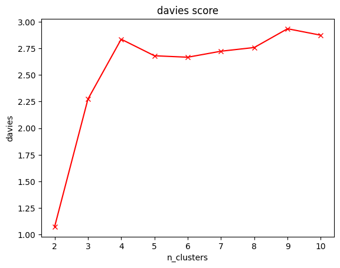

O to wyniki dla 2 klastrów, które zostały wybrane na podstawie powyższych wykresów.
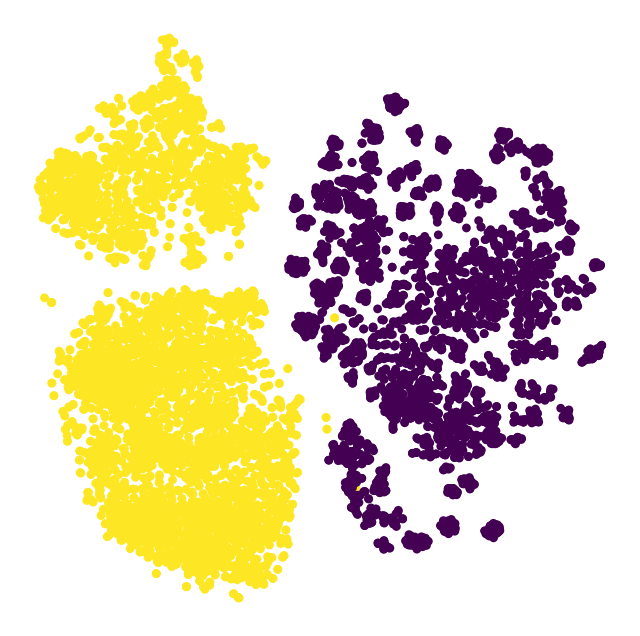

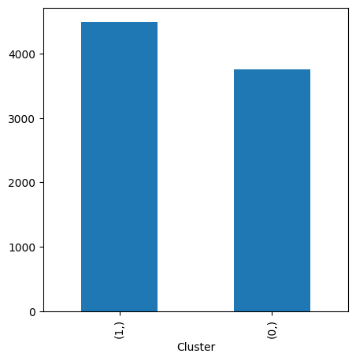

## 5. Wyniki
Mając wstępne wyniki modelowania przyszedł czas na wybór najlepiej sprawującego się modelu dla naszego problemu.

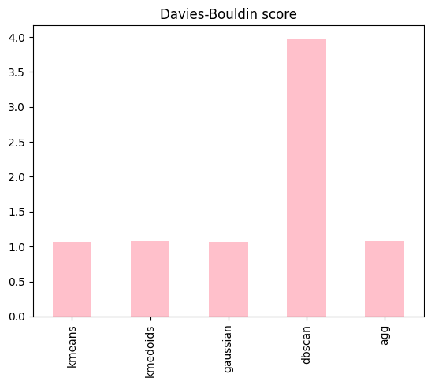
Powyższe wykresy jednoznacznie wskazują na słabość DBSCANA. Zatem nie będziemy się już jemu dalej przyglądali, ponieważ psuje nam skalę i porównanie pomiędzy innymi modelami.

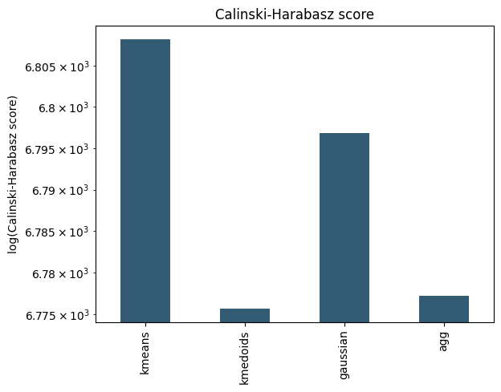
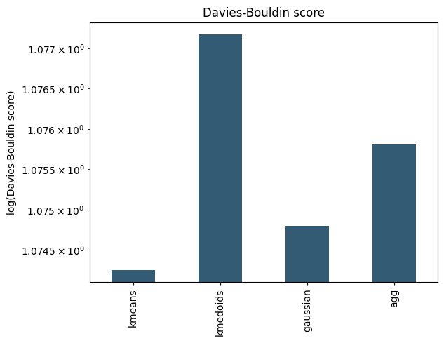
Widzimy, że najlepiej działa KMeans. Posiada on najwyższe wyniki w metrykach Silhouette'a i Calinskiego-Harabasza oraz najniższy w metryce Daviesa-Bouldina. Zostaje on zatem wybrany jako nasz główny model.
Przyjrzyjmy się na czym nasz model rozróżnia, który element należy do którego klasta.

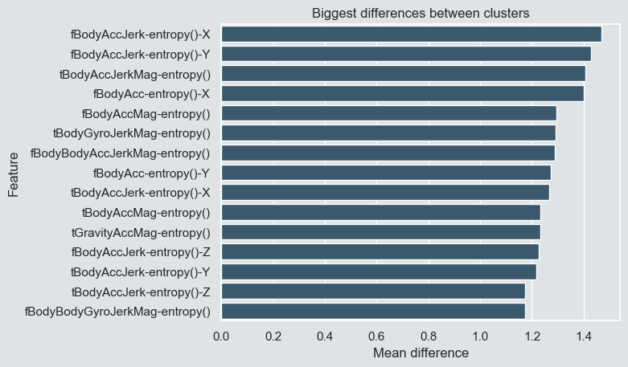

Jak można się było spodziewać, model stwierdza na podstawie sygnałów przyśpieszenia oraz zrywu, który klaster pasuje dla danego elementu. Pokrywa się to z wizualizacjami, które pokazują dwa różne klastry. Mogą one reprezentować aktywny oraz bardziej spokojny tryb życia obiektów testowych

#### Sześć klastrów
Wracając do opisu naszej ramki, autorzy badania przydzielili sześć różnych indeksów danym obserwacjom. Sprawdźmy jak KMeans sprawuje się dla właśnie sześciu klastrów.

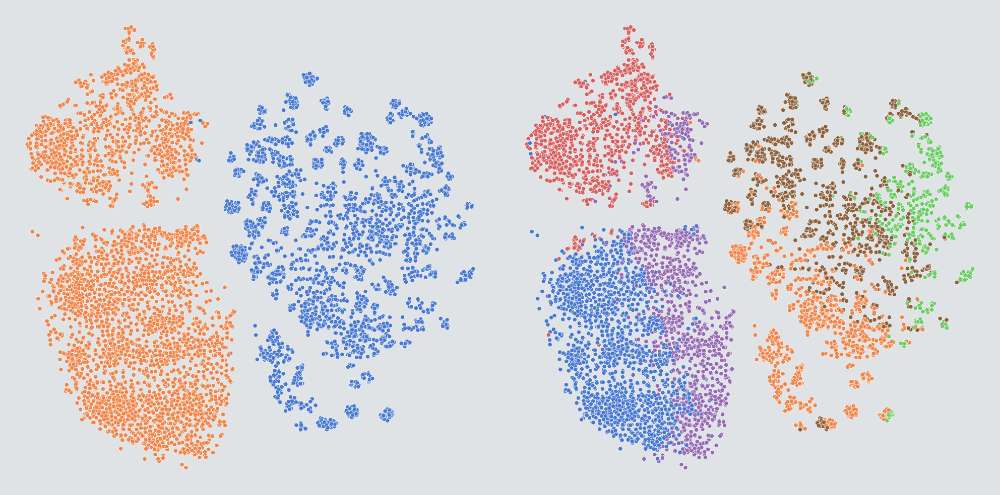
Obserwujemy znaczące spadki w efektywności modelu. Obserwując wyniki danych metryk, możemy stwiedzić osłabienie nowego modelu oraz słabość konceptu sześciu klastrów.
Na wizualizacji widać, że początkowe dwa klastry zostały wewnętrznie jeszcze bardziej podzielone. Może to cieszyć, ponieważ model nadal rozróżnia bardziej i mniej aktywny tryb życia. Możliwe że jest on w stanie rozróżnić inne aktywności, jednakże wyniki metryk nie są zachęcające.

## 6. Wnioski
Wybrany przez nas model KMeans dla dwóch klastrów efektywnie działa na danej ramce danych. Zalicza wysokie wyniki metryk oraz na wizualizacjach otrzymane klastry są łatwo rozróżnialne i dobrze wyszczególnione. 
Sposób rozróżniania obserwacji pokrywa się z intuicją, na podstawie której odzielilibyśmy aktywności na podstawie sygnałów o przyśpieszeniu i zrywie.
Dla sześciu klastrów model nie spełnia naszych oczekiwań wypadając gorzej od naszej domyślnej wersji, pomimo tego że dane przewidują występowanie aż sześciu różnych aktywności obiektów testowych. Nie jest to jednak odzwierciedlone w naszym przypadku.